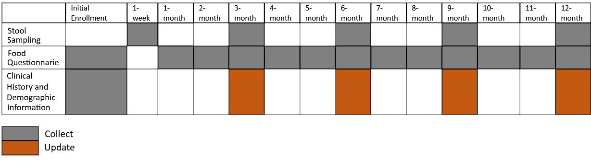
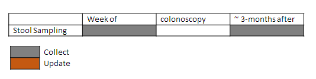
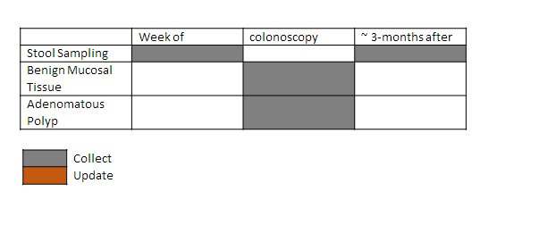
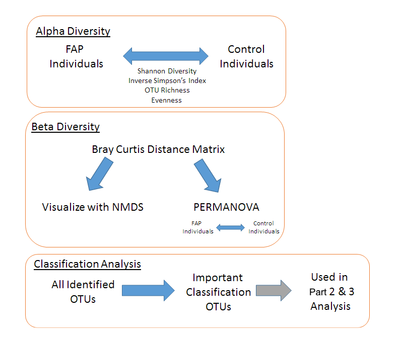
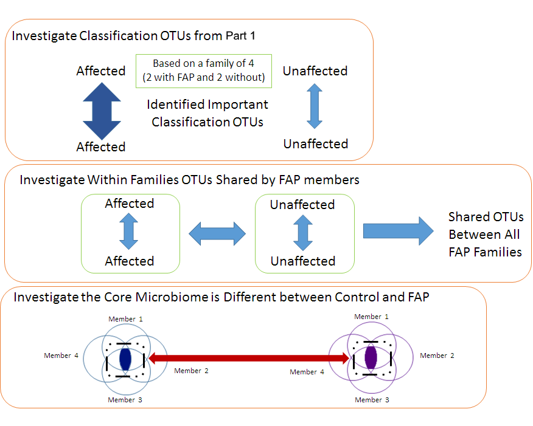
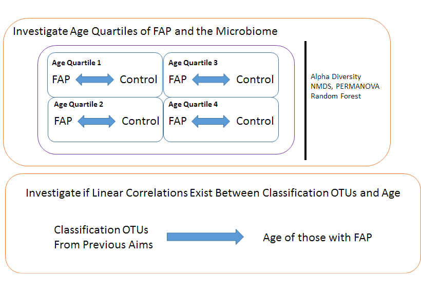

# Schloss Lab Presentation
## Chalk Talk: The Microbiome in Families with and without Familial Adenomatous Polyposis
### March 9, 2016
### Marc Sze

****

#### Overarching Hypothesis  
That there are detectable differences in the microbiome between families with and without Familial Adenomatous Polyposis (FAP) 

#### Three Overarching Aims

* To provide answers to the question of whether or not there is a bacterial microbiome that is unique to those only with FAP or Lynch syndrome.  This will be done by the collection of a stool sample biorepository and relevant meta data.  
  
* To create a longitudinal biobank of samples and meta data to investigate whether there are changes in the “core” microbiome of those with FAP or Lynch syndrome that can predict progression or severity of disease.  

* The creation of a tissue biorepository of benign mucosal tissue and adenomatous polyps.  This will be used to provide answers to the question of whether or not there are different microbiomes between normal and adenomatous tissue within the same individual with FAP or Lynch syndrome.  

****

#### Enrolment 

* OMNIgeneGut (OMR-200) for stool collection 
	* Company provides a [YouTube video](https://www.youtube.com/watch?v=ytr_hmJdHqM) for instructions on how to self sample stool
* Recruitment will be worked around regular clinic visits
	* For control families web and mail services will be utilized for recruitment
	* Plan is to follow families for at least 10 years
* Questionnaires will be completed at initial enrolment
	* Updates will be completed with next stool sampling and mailed to the study centre
* Total Target enrolment is 25 families with FAP (~n=100) and at least 10 families without FAP (~n=40)
* **Two** stool samples per person will be collected for Aim 1 and 2
* **Benign** and **Polyp** tissue will be collected from Aim 3

****

#### Sample Collection

**Sampling Overview: Aim 1 and Aim 2**

*No colonoscopy:*

 

*Colonoscopy Occurs:*

**Sampling Overview: Aim 3**

****

## Analysis Planning: Or in other words what we know we will definitely analyze

### 16S Bacterial Microbiome Analysis Aim 1 and 2 (What bacteria are there analysis)

**Part 1 Analysis**

**Part 2 Analysis**

**Part 3 Analysis**

## Analysis Planning: Or in other words what we know we might want to analyze

* What would be the best use for the second stool sample?
* Metagenomics, Metatranscriptomics, Metabolomics or a more targeted approach in the analysis?
* Should we stay with bacteria or make plans to expand to other domains (e.g. Fungi, Viruses)?
* A lot of longitudinal data will be generated, what sort of Big data storage should we use?

****

### 16S Bacterial Microbiome Analysis Aim 3 (What bacteria are there analysis)

**Part 4 Analysis**

* For the tissue based analysis main interest would be to compare normal benign tissue versus polyp tissue

## Analysis Planning: Or in other words what we know we might want to analyze

* Biggest question is whether we should also look at human transcriptome as well as the aforementioned other possibilities?
	* Would we generate enough sample to be able to do this?
		* After watching everything my personal opinion is that it might be possible.
			* But sample is very small (1-2 cm3)
* Another question is whether we could do human but only look at a selection of genes or markers

****