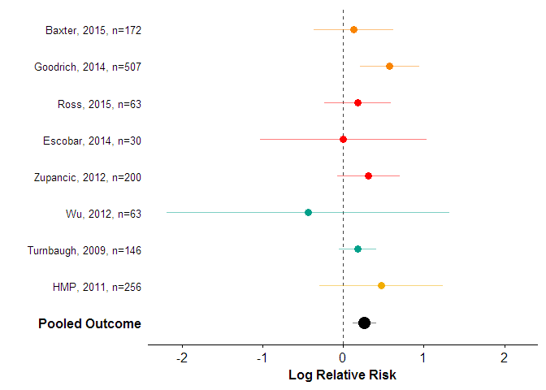
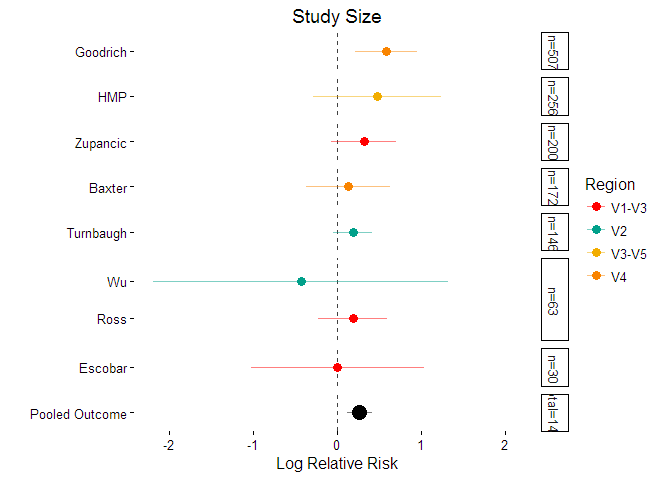

# Recap of Schloss Lab Graph Hack-a-thon: Base versus ggPlot2
Marc Sze  
June 29, 2016  


##Disclaimer

*My first disclaimer is that I feel that I should state ahead of time that I am a ggplot2 user and so I may be slightly biased as to which I prefer or think "won" our labs first graphing hack-a-thon.*
<br><br>
*My second disclaimer is that I originally decided to try this for our lab code review for partly selfish reasons.  Basically I though my lab mates could provide interesting and neat ways to visualize and improve the standard forest plot that I could use*
<br><br>

##Outline

So with that all out of the way this post will take the following format:

1.  General Overview
2.  Teams
3.  Graphs by Team
4.  Final Thoughts
<br><br>

##General Overview

The lab was split into teams of two listed later on below and will be assigned the use of either ggplot2 or base to create **their own** version of this graph:

<!-- -->


I use ggplot2 so that was what I used to make this example.
All the data that you will need can be found in the `.csv` file titled *test3R.csv*. Simply clone the repository and follow the below instructions and you will be on your way:
  
*   Copy the repo  ```git clone https://github.com/marcsze/SchlossLabPresentations.git```
*   Move into the `2016_06_23` directory of `SchlossLabPresentations`
*   Move these files to whatever directory you want them in
*   Work with your team to create a kick-!@# graph

The usage of either base or ggplot2 was preassigned and what each team used will be listed later below.  If teams want to see the actual code used to build the graph in they can take a look at the `.R` file also provided with this repo.  
  
There will be a 5-10 mins intro on my graph version and the data table so that everyone is on the same page with respects to what the data is trying to represent.  The next 35 mins will be dedicated to creating a graph in your teams, the next 15 mins will be left open to view the graphs and comment on what everyone on the team liked and did not like about making the graph as well as general comments and open discussion.  Each team is expected to utilize a team coding approach and will use only one computer between the two of them.
<br><br>

##Teams

* Matt J and Matt D - *Base*
* Geoff and Kaitlin - *ggplot2*
* Pat - *Base*
* Nick and Marian - *ggplot2*
<br><br>

##Graphs by Teams

####Pat - Team Base

<!-- -->

So there are some neat things going on here.  Pat decided to add legend which in my example was excluded.  The other nice touch is keeping a box to surrond the plot.  I am not sure whether I prefer having no box.   The other Pat did was get rid of the study year that was displayed in the example graph.  One small, but perhaps significant detail, is that Pat did two things differently with his vertical line at 0.  First, he has made it gray instead of black which I think helps make it less of a focus.  In other words it stands out less.  The second thing he did was to make the horizontal line fall behind the points instead of in front of them like the example graph.
<br><br>

####Geoff and Kaitlin - Team ggplot2

<!-- -->


So here Geof and Kaitlin have also opted for a box to surrond the entire data.  One thing that I found neat was the use of `theme_bw()` which removes the usual gray background that is default for ggplot2 graphs.  They also added a y-axis label and a graph title.  Similar to Pat's graph they decided to keep a legend attached to the graph.  They opted also to keep the ends on their CI lines unlike both the example and Pat's graph.  The final interesting point is that they decided to have the y axis not go to 2 log fold.  One additional point should be noted that Geof and Kaitlin managed to significantly reduce the amount of code used versus both Pat and the example graph.  
<br><br>

####Matt J and Matt D - Team Base

<!-- -->

So team Matt decided to re-make the original `.csv` file and for their analysis they used one called `test3R_edited.csv`.  They also like Geoff and Kaitlin tried to go with a minimal code approach.  Like the two previous teams they also opted for a box around the data points.  Unlike the other two teams though they sorted the display based on the variable region used.  This is a similar approach used as the example graph.  
<br><br>

####Marian and Nick - Team ggplot2

<!-- -->


First, off it should be noted that Marian and Nick did go over time so it is possible that the other teams may have come up with a similar design with the same extra 10-15mins that they got.  Regardless, though they came up with some really neat ideas on how to display the information.  They have a multi-panel plot but I thought I would focus on their 16S region plot since it is the most similar to the others.  Some of the changes they made have already been covered by previous teams (adding a title to the graph, getting rid of the year and sample size in the study labels, and adding a legend). However, one major chnage that they added within the graph is faceting.  So there is not extra information built into the graph based on the study size.  With the largest study at the top and smaller studies closer to the bottom (excluding the pooled final n).  They have done this while keeping the coloring for the variable regions.  As an aside I changed their colour scheme to the same as the example because they had some of the same colors assigned to multiple variable regions.  Honestly, I really like the potential of where you can go after building this initial framework.
<br><br>


##Final Thoughts

Overall I think everyone came away with the notion that for the most part what you can do with ggplot2 you can do with base.  I personally still think that building the actual graph is simpler with ggplot2 than it is with base.  This is a personal opinon though and in the end both methods, when used properly, can give you great visaulizations.  Perhaps the one stand out aspect of ggplot2 that we found was the ability to easily facet the data into groups and organize the graph based on this.  Being able to easily perform this step can add a lot of extra information to the graph as demonstrated by Marian and Nick.
<br><br>

It would be nice to have this again at some point in time with a different data set and graph type.  Additionaly, we could also add other programs like python to see how they perform.  Most importantly, I think we all learned at least one or two interesting things about both base and ggplot2 that could be used in future projects.
<br><br>

So who won?  Well the comp out answer would be that we all won.  However, even with a time penalty, I think Marian and Nick really had the most unique take on the data.  They also showcased an aspect of ggplot2 that makes it such a strong tool.


