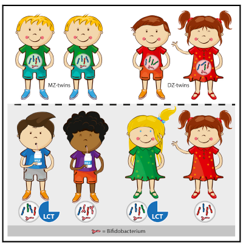

# Journal Club

## Genetic Determinants of the Gut Microbiome in UK Twins

Here is the presentation for the review of a study that does some things I would like to do.  Most of the analysis is on cross-sectional samples while I would like to apply things to both cross-sectional and longitudinal data.

  
