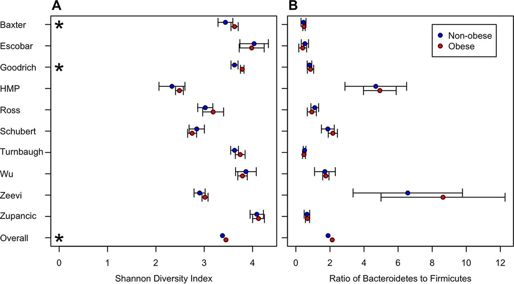

# Schloss Lab Graphing Hack-a-thon
## Create a better Visualization

**General Overview**

I wanted to add to the cool graph stuff that came out of the last code review.  Building on the theme from the last hack-a-thon I thought we would continue with the discussion of building a better visual, whether it be in base, ggplot2 or some other package or program you like to use.

There is a figure that I think can be improved upon (I like it, I just think that it could potentially be better).  So I've decided to crowd source alternative ideas via lab meeting.  As a byproduct I hope that we all learn something today that we did not konw previously about graphing in R.

The figure below is an example of what was used.  My question to you, and there is no wrong answer, how would you make this better or clearer to an audience?




Like the last time we did this as a lab eaveryone will be split into teams of two listed below.  The one difference from before is taht there is no limitation on what program or package you can use.  Only that both members in the group have to agree to it. I really want to see **your own interpretation** of the graph above.  All the data that you will need can be found in the `alpha_tests.summary` file.  The easiest way to get the data would be to clone the repository and follow the below instructions and you will be on your way:
  
*   Copy the repo  ```git clone https://github.com/marcsze/SchlossLabPresentations.git```
*   Move into the `2016_11_10` directory of `SchlossLabPresentations`
*   Move these files to whatever directory you want them in
*   Work with your team to create a kick-!@# graph

Now, if this command does not work there will be a USB provided during the session so that you will be able to get the data without any hassale or significant loss of time to make the graph.
  
Unlike the last hack-a-thon the goal is less on refining the displayed current graph and more on exploding it and creating something new and different from the original.  So the code to make it is less relevent but I can find it and show it if absolutely necessary.  It can be found in the github repo for the [obesity paper](https://github.com/SchlossLab/Sze_Obesity_mBio_2016/tree/master/code). 
  
The plan is to give a brief 5-10 mins intro on the graph and the display goals and the data table so that everyone is on the same page with respects to what the data is trying to represent.  The next 30 mins will be dedicated to creating a graph in your teams, the next 20 mins will be left open to view the graphs and comment on what everyone on the team liked and did not like about the created graph.

For the challenge we will be using a paired programming approach.  This means one computer shared between two people.


**Teams**

Matt J and Nick

Geoff and Charlie

Pat and Matt D

Kaitlin and Amanda


   
