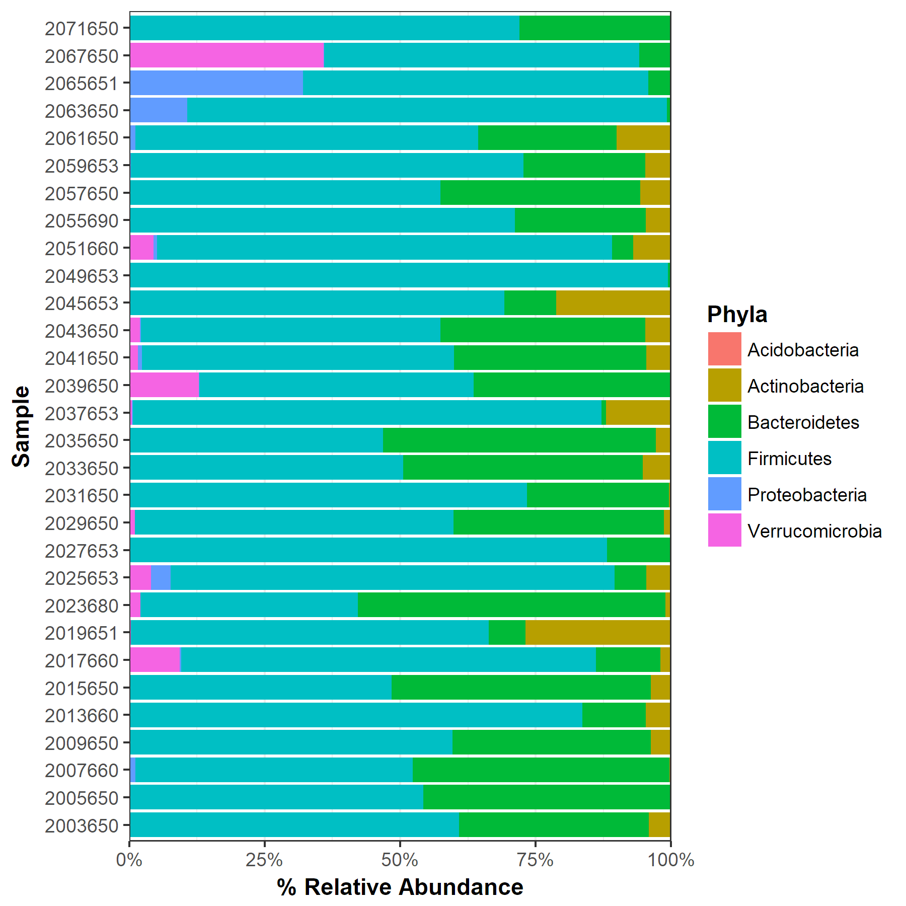

# Relative Abundance Code Review

The purpose of this session is to work in groups to generate a percent relative abundance file for either all OTUs or at the phyla level. 
We will go over the data tables that will be used together. **Please do not look at the code.R file.** The whole purpose of this code 
reivew is to see the different ways that people go about generating relative abundnace metrics.  My own version is in code.R and copying 
this version or slightly tweaking it is not the purpose of this exercise.  You can use whatever tools you want within R to accomplish 
the task.

**You should absolutely have in your pulled repo:**
* example.shared
* example.taxnomy

With these two files you should be able to participate completely in the exercise at hand.

**Goals:**  
1. Generate Relative Abundance for every OTU
2. Generate Relative Abundance at the Phyla level
3. Create a stacked bar plot for similarity comparison (If time permitting)

**Teams:**

1. Matt D and Matt J
2. Pat, Geoff, and Charlie
3. Marian and Nick
4. Kaitlin and Amanda

**My Own Bar Plot** *(For comparison purposes)***:**

